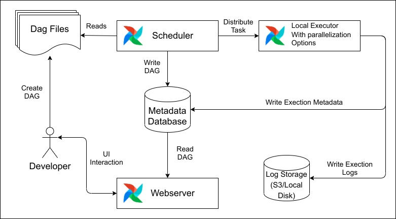
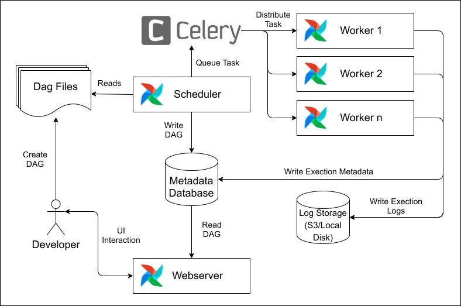

# Airflow Architecture

## Sequential & Local Executor

[](https://airflow.apache.org/docs/apache-airflow/stable/executor/local.html)

### Sequential Executor

SequentialExecutor is the default executor when you first install airflow. It is the only executor that can be used with sqlite since sqlite doesn’t support multiple connections. This executor will only run one task instance at a time. For production use case, please use other executors.sfd

### Local Executor

LocalExecutor runs tasks by spawning processes in a controlled fashion in different modes.

Given that BaseExecutor has the option to receive a `parallelism` parameter to limit the number of process spawned,
when this parameter is `0` the number of processes that LocalExecutor can spawn is unlimited.

The following strategies are implemented:

- | **Unlimited Parallelism** (`self.parallelism == 0`): In this strategy, LocalExecutor will
  | spawn a process every time `execute_async` is called, that is, every task submitted to the
  | `airflow.executors.local_executor.LocalExecutor` will be executed in its own process. Once the task is executed and the
  | result stored in the `result_queue`, the process terminates. There is no need for a
  | `task_queue` in this approach, since as soon as a task is received a new process will be
  | allocated to the task. Processes used in this strategy are of class `airflow.executors.local_executor.LocalWorker`.

- | **Limited Parallelism** (`self.parallelism > 0`): In this strategy, the `airflow.executors.local_executor.LocalExecutor` spawns
  | the number of processes equal to the value of `self.parallelism` at `start` time,
  | using a `task_queue` to coordinate the ingestion of tasks and the work distribution among
  | the workers, which will take a task as soon as they are ready. During the lifecycle of
  | the LocalExecutor, the worker processes are running waiting for tasks, once the
  | LocalExecutor receives the call to shutdown the executor a poison token is sent to the
  | workers to terminate them. Processes used in this strategy are of class `airflow.executors.local_executor.QueuedLocalWorker`.

Arguably, `airflow.executors.sequential_executor.SequentialExecutor` could be thought as a `LocalExecutor` with limited
parallelism of just 1 worker, i.e. `self.parallelism = 1`.
This option could lead to the unification of the executor implementations, running
locally, into just one `airflow.executors.local_executor.LocalExecutor` with multiple modes.

## Celery Executor

[](https://airflow.apache.org/docs/apache-airflow/stable/executor/local.html)

`CeleryExecutor` is one of the ways you can scale out the number of workers. For this
to work, you need to setup a Celery backend (**RabbitMQ**, **Redis**, ...) and
change your `airflow.cfg` to point the executor parameter to
`CeleryExecutor` and provide the related Celery settings.

For more information about setting up a Celery broker, refer to the
exhaustive `Celery documentation on the topic <http://docs.celeryproject.org/en/latest/getting-started/brokers/index.html>`\_.

Here are a few imperative requirements for your workers:

- `airflow` needs to be installed, and the CLI needs to be in the path
- Airflow configuration settings should be homogeneous across the cluster
- Operators that are executed on the worker need to have their dependencies
  met in that context. For example, if you use the `HiveOperator`,
  the hive CLI needs to be installed on that box, or if you use the
  `MySqlOperator`, the required Python library needs to be available in
  the `PYTHONPATH` somehow
- The worker needs to have access to its `DAGS_FOLDER`, and you need to
  synchronize the filesystems by your own means. A common setup would be to
  store your `DAGS_FOLDER` in a Git repository and sync it across machines using
  Chef, Puppet, Ansible, or whatever you use to configure machines in your
  environment. If all your boxes have a common mount point, having your
  pipelines files shared there should work as well

To kick off a worker, you need to setup Airflow and kick off the worker
subcommand

```bash
airflow worker
```

Your worker should start picking up tasks as soon as they get fired in
its direction.

Note that you can also run "Celery Flower", a web UI built on top of Celery,
to monitor your workers. You can use the shortcut command `airflow flower`
to start a Flower web server.

Please note that you must have the `flower` python library already installed on your system. The recommend way is to install the airflow celery bundle.

```bash
pip install 'apache-airflow[celery]'
```

Some caveats:

- Make sure to use a database backed result backend
- Make sure to set a visibility timeout in `[celery_broker_transport_options]` that exceeds the ETA of your longest running task
- Tasks can consume resources. Make sure your worker has enough resources to run `worker_concurrency` tasks
- Queue names are limited to 256 characters, but each broker backend might have its own restrictions
