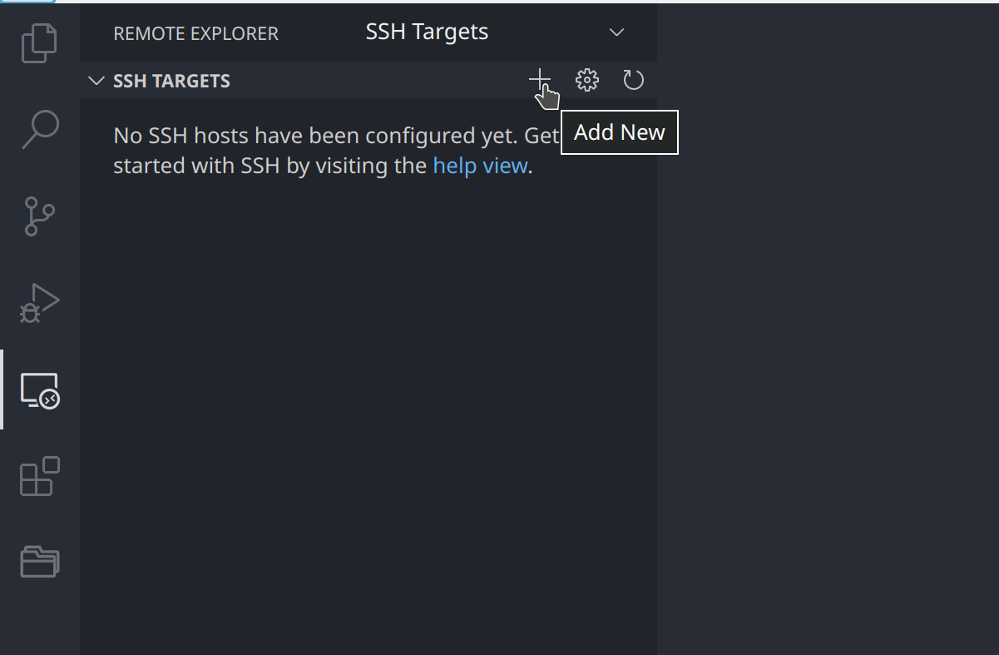

# Setup Development Environment

## Setup Visual Studio Code (VS Code)

1. Download access key [**in here**](../access-key/README.md)
2. Install VS Code [**Remote Development Extension**](https://marketplace.visualstudio.com/items?itemName=ms-vscode-remote.vscode-remote-extensionpack)
3. Add new ssh targets
   - Open Remote Explorer on sidebar
   - Click plus button (`+`) on SSH Targets
     
   - Input ` ssh -i [KEY_LOCATION]/pmi-key-pair.pem ubuntu@54.169.179.151`. Replace `KEY_LOCATION` with directory path where you stored the key. For example `ssh -i .keys/pmi.pem ubuntu@54.169.179.151`
   - When connected it will show you list of available ssh targets
     
   - Right click `airflow` folder and you can choose whether will open on current window or new window
   - 
4. Access remote server with VS Code remote server
5. Create new directory with your own unique name inside `/dags` directory for example `john_doe`
   
6. This new directory will be your workspace for training. All python scripts must be placed here for airflow to be able execute your scripts.
7. To test your setup, open VS Code terminal by click menu `Terminal > New Terminal` or with shortcut `` ctrl + ` `` (on windows and linux) or `` cmd + ` `` (on mac)
8. Type `airflow list_dags`. It will show list of dags available on airflow
   

## Setup Jupyter Notebook
[Jupyter](https://marketplace.visualstudio.com/items?itemName=ms-toolsai.jupyter)

