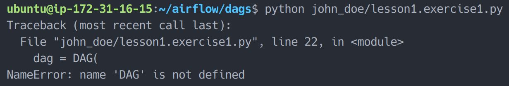
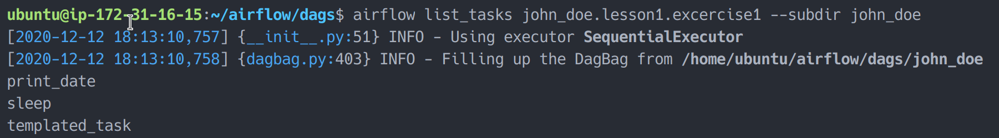
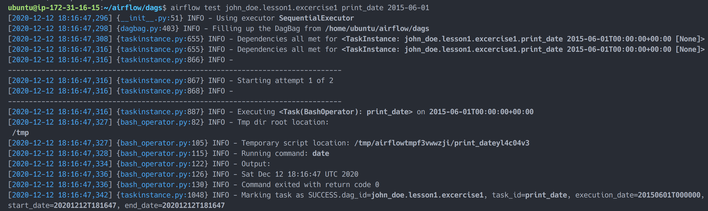

# Simple Pipeline

## Create Simple Dag

1. Create new python file on your workspace directory with name `lesson1.exercise1.py`
2. Paste this code:

   ```python
   #
   # Instructions: Find error in this code
   #

   from datetime import timedelta

   #from airflow import DAG
   from airflow.operators.bash_operator import BashOperator
   from airflow.utils.dates import days_ago

   default_args = {
       'owner': 'john_doe', # Replace with your name
       'depends_on_past': False,
       'start_date': days_ago(2),
       'email': ['airflow@example.com'],
       'email_on_failure': False,
       'email_on_retry': False,
       'retries': 1,
       'retry_delay': timedelta(minutes=5)
   }
   dag = DAG(
       'lesson1.excercise1',
       default_args=default_args,
       description='DAG simple pipeline',
       schedule_interval=timedelta(days=1),
   )

   t1 = BashOperator(
       task_id='print_date',
       bash_command='date',
       dag=dag,
   )

   t2 = BashOperator(
       task_id='sleep',
       depends_on_past=False,
       bash_command='sleep 5',
       retries=3,
       dag=dag,
   )
   dag.doc_md = __doc__

   t1.doc_md = """\
   #### Task Documentation
   You can document your task using the attributes `doc_md` (markdown),
   `doc` (plain text), `doc_rst`, `doc_json`, `doc_yaml` which gets
   rendered in the UI's Task Instance Details page.
   """
   templated_command = """
   
       echo "{{ ds }}"
       echo "{{ macros.ds_add(ds, 7)}}"
       echo "{{ params.my_param }}"
   
   """

   t3 = BashOperator(
       task_id='templated_task',
       depends_on_past=False,
       bash_command=templated_command,
       params={'my_param': 'Parameter I passed in'},
       dag=dag,
   )

   t1 >> [t2, t3]
   ```

   \*Replace `john_doe` with your name

3. Test the code above by this command:
   ```bash
   python lesson1.exercise1.py
   ```
   and will result this:
   
4. Fix error found!

## Testing

### Metadata Validation

1. Validate if dag is successfully loaded by this command:
   ```bash
   airflow list_dags --subdir john_doe
   ```
   change `john_doe` to your name.
   if DAG successfully loaded then it will show in the list:
   
2. Validate if task is loaded by this command:
   ```bash
   airflow list_tasks lesson1.excercise1 --subdir john_doe
   ```
   result this:
   
3. Validate task hirarchy
   ```bash
   airflow list_tasks lesson1.excercise1 --subdir john_doe
   ```
   result this:
   

### Testing Each Task

1. Test `print_date` task
   ```bash
   airflow test lesson1.excercise1 print_date 2015-06-01
   ```
   
   note on the last line you will see difference between `execution_date`, `start_date` and `end_date`
2. Test `sleep` task
   ```bash
   airflow test lesson1.excercise1 sleep 2015-06-01
   ```
3. Test `templated_task` task
   ```bash
   airflow test lesson1.excercise1 templated_task 2015-06-01
   ```
