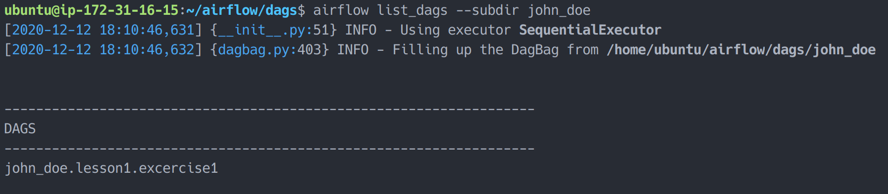

# 6. Writing Pipeline

## 6.1 Writing Simple DAG

Goto your VSCode workspace directory and create python file with name `lesson1.exercise1.py` and paste this code:

```python
   #
   # Instructions: Find error in this code
   #

   from datetime import timedelta

   #from airflow import DAG
   from airflow.operators.bash_operator import BashOperator
   from airflow.utils.dates import days_ago

   owner = 'john_doe' # Replace with your short name

   default_args = {
       'owner': owner,
       'depends_on_past': False,
       'start_date': days_ago(2),
       'email': ['airflow@example.com'],
       'email_on_failure': False,
       'email_on_retry': False,
       'retries': 1,
       'retry_delay': timedelta(seconds=5)
   }
   dag = DAG(
       f'{owner}.lesson1.excercise1',
       default_args=default_args,
       description='DAG simple pipeline',
       schedule_interval='@daily',
   )

   t1 = BashOperator(
       task_id='print_date',
       bash_command='date',
       dag=dag,
   )

   t2 = BashOperator(
       task_id='sleep',
       depends_on_past=False,
       bash_command='sleep 5',
       retries=3,
       dag=dag,
   )

   t3 = BashOperator(
       task_id='final_task',
       depends_on_past=False,
       bash_command='echo "I am final task"',
       dag=dag,
   )

   t1 >> t2 >> t3
```

_\*Replace `john_doe` with your name_

Open your VSCode terminal, navigate to DAG directory on `/home/ubuntu/airflow/dags` and paste this command:

```bash
cd /home/ubuntu/airflow/dags
python john_doe/lesson1.exercise1.py #Replace `john_doe` with your name
```

What is the result? if error occured could you fix it?


After fix the error, run this command

```bash
airflow list_dags --subdir john_doe
```

and voila, your first DAG is created


### 6.1.1 Import Module Dependencies

```python
from datetime import timedelta

from airflow import DAG
from airflow.operators.bash_operator import BashOperator
from airflow.utils.dates import days_ago
```

This section of code will import module you needed to run your airflow DAG. As previous section mention if you forgot import module required airflow will raised errors.

### 6.1.2 Owner Variable

```python
owner = 'john_doe' # Replace with your short name
```

This is normal python variable declaration and required for this workshop because multiple users will be using one airflow instance at the same time.

**If you writing your actual pipeline, then this variable might not be required.**

### 6.1.3 Default Arguments

```python
default_args = {
   'owner': owner,
   'depends_on_past': False,
   'start_date': days_ago(2),
   'email': ['airflow@example.com'],
   'email_on_failure': False,
   'email_on_retry': False,
   'retries': 1,
   'retry_delay': timedelta(seconds=5)
}
```

Default arguments will be passed on each task and became default value.

- `owner` _([str](https://docs.python.org/3/library/stdtypes.html#str))_ is argument to set DAG owner, for current airflow version there are no restriction who is owner might be. But, with this argument we could easily filter DAG based on ownership. For example you want to show DAGs that belong to finance dept only. In here owner will be filled with variable owner above.
- `depends_on_past` _([bool](https://docs.python.org/3/library/functions.html#bool))_ is argument to configure task run wether depends on previous task run or not. If set `True` then current task will not run if previous tasks still not finished and if set `False` previous and current task could run in parallel.
- `start_date` _([datetime.datetime](https://docs.python.org/3/library/datetime.html#datetime.datetime))_ set when DAG will started for the first time. In here DAG will start from `2 days ago`. This argument must be filled with valid datetime value. It could also filled with fix date for example `'start_date': date(2020, 10, 23)`
- `email` _([str](https://docs.python.org/3/library/stdtypes.html#str) or [list](https://docs.python.org/3/library/stdtypes.html#list)[[str](https://docs.python.org/3/library/stdtypes.html#str)])_ is argument to set DAG email destination, because it require array of string it can be filled with multiple email address for example `'email': ['airflow@example.com', 'john.doe@example.com']`
- `email_on_failure`_([bool](https://docs.python.org/3/library/functions.html#bool))_ is argument to decide whether airflow will send email on failure or not.
- `email_on_retry` _([bool](https://docs.python.org/3/library/functions.html#bool))_ is argument to decide whether airflow will send email when retry failed task or not.
- `retries` _([int](hhttps://docs.python.org/3/library/functions.html#int))_ how many task could be retried when failed
- `retry_delay` _([datetime.timedelta](https://docs.python.org/3/library/datetime.html#datetime.timedelta))_ is how long delay on retry failed task

More complete arguments documentation could be read on [official documentation](https://airflow.apache.org/docs/apache-airflow/stable/_api/airflow/models/baseoperator/index.html)

**Each tasks on the DAG are able to override default arguments above**

### 6.1.4 DAG Definition

```python
dag = DAG(
   f'{owner}.lesson1.excercise1',
   default_args=default_args,
   description='DAG simple pipeline',
   schedule_interval='@daily',
)
```

Here we are define our DAG variable.

- First arguments is DAG id and it must be unique that is why there are `owner` variable in there. It will make your DAG unique and necessary in this workshop.

  _Notes: When there are two DAGs has same ID then the newer DAG will replace the old DAG without confirmation_

- `default_args` will set DAG default arguments
- `schedule_interval` is time interval DAG will run, default is `None`

### 6.1.5 DAG Run Schedule

Each DAG may or may not have a schedule, which informs how DAG Runs are
created. `schedule_interval` is defined as a DAG argument, and receives
preferably a [cron expression](https://en.wikipedia.org/wiki/Cron#CRON_expression) or a `datetime.timedelta` object.

Alternatively, you can also use one of these cron "presets".

| preset       | meaning                                                         | cron          |
| ------------ | --------------------------------------------------------------- | ------------- |
| `None`       | Don't schedule, use for exclusively "externally triggered" DAGs |               |
| `@once`      | Schedule once and only once                                     |               |
| `@hourly`    | Run once an hour at the beginning of the hour                   | `0 * * * *`   |
| `@daily`     | Run once a day at midnight                                      | `0 0 * * *`   |
| `@weekly`    | Run once a week at midnight on Sunday morning                   | `0 0 * * 0`   |
| `@monthly`   | Run once a month at midnight of the first day of the month      | `0 0 1 * *`   |
| `@quarterly` | Run once a quarter at midnight on the first day                 | `0 0 1 */3 *` |
| `@yearly`    | Run once a year at midnight of January 1                        | `0 0 1 1 *`   |

#### Example:

- Using cron expression:
  ```python
  schedule_interval='0 0 * * 0'
  ```
- Using cron preset:
  ```python
  schedule_interval='@daily'
  ```
- Using `datetime.timedelta` object:
  ```python
  schedule_interval=timedelta(days=1)
  ```

### 6.1.6 Tasks

```python
t1 = BashOperator(
   task_id='print_date',
   bash_command='date',
   dag=dag,
)

t2 = BashOperator(
   task_id='sleep',
   depends_on_past=False,
   bash_command='sleep 5',
   retries=3,
   dag=dag,
)

t3 = BashOperator(
   task_id='final_task',
   depends_on_past=False,
   bash_command='echo "I am final task"',
   dag=dag,
)
```

As mention earlier on Airflow Concepts, DAG consists of one or more tasks. In the code above is declare 3 task which execute bash command

- `t1` is task to print date
- `t2` task to sleep 5 seconds. Pay attentenion on argument `retries=3` in this task is overriding default argument `'retries': 1` on DAG declaration. It means this task able to retry three times.
- `t3` task to print string `"I am final task"`

_Caution: argument `task_id=` must be unique or old task will be replaced by newer task with the same id. Also argument `dag=` must be filled with variable `dag` declared earlier._

### 6.1.7 Task Dependecy

```python
t1 >> t2 >> t3
```

Code above is to define dependencies between task it means `t2` execution must wait `t1` finish and `t3` execution must wait `t2` execution success.

Here’s a few ways you can define dependencies between tasks:

```python
t1.set_downstream(t2)

# This means that t2 will depend on t1
# running successfully to run.
# It is equivalent to:
t2.set_upstream(t1)

# The bit shift operator can also be
# used to chain operations:
t1 >> t2

# And the upstream dependency with the
# bit shift operator:
t2 << t1

# Chaining multiple dependencies becomes
# concise with the bit shift operator:
t1 >> t2 >> t3

# A list of tasks can also be set as
# dependencies. These operations
# all have the same effect:
t1.set_downstream([t2, t3])
t1 >> [t2, t3]
[t2, t3] << t1
```

## 6.2 Testing

### 6.2.1 Metadata Validation

Metadata validation is process to check whether Airflow able to load new defined DAG.

First we must validate if DAG is successfully loaded by run this command:

```bash
airflow list_dags --subdir john_doe
```

_change `john_doe` to your name._

if DAG successfully loaded then it will show in the list:


Then we need validate if all task we defined inside DAG is loaded by run this command:

```bash
airflow list_tasks [DAG_ID] --subdir john_doe
```

If all task is succesfully loaded then all of them will be listed here


You can also validate task hierarchy by run this command:

```bash
airflow list_tasks [DAG_ID] --subdir john_doe --tree
```

This command will get your task hierarchy based on task dependencies you defined.


### 6.2.2 Testing Individual Task

Command to task each task is

```bash
airflow test [DAG_ID] [TASK_ID] [EXECUTION_DATE]
```

For example to test task `print_date`, the correct command is

```bash
airflow test john_doe.lesson1.excercise1 print_date 2015-06-01
```

and will result:


## 6.3 Exercise:

Try it yourself Testing task `sleep` and `final_task`
