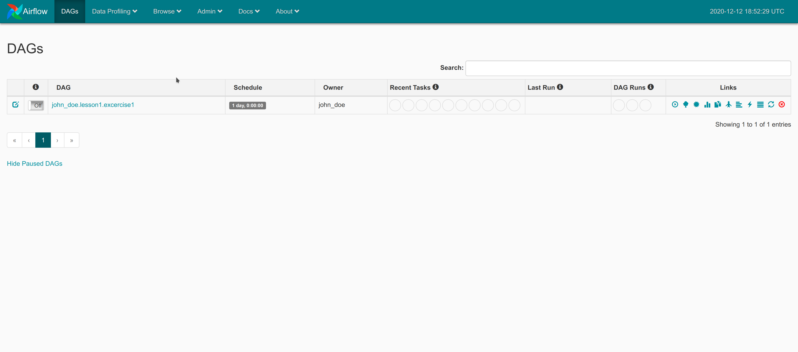
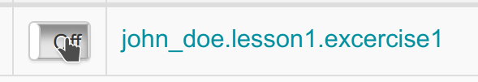
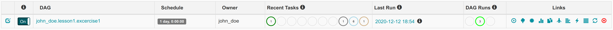

## Run DAG

### Turn On DAG

1. Open [Airflow UI](http://54.169.179.151:8080/admin/)
   
2. Run dag by press icon `trigger`  on `Links` column and watch what happen
3. Airflow will trigger `1 Dag Runs` and because in that specific DAG has `3 tasks` then there are exactly 3 task active in column `Recent Task`. But, you will notice after sometimes and refresh airflow seems stuck. Task status is not updated and `Dag Runs` still `1`
4. That happen because **DAG is still off**, to turn it on, change toggle on the left side of table 
5. After `on` you will notice that task is starting run
   
   But why DAG Runs become `3` even though you only click `trigger` once?
6. That happen because of this
   ```python
   default_args = {
      'owner': owner,
      'depends_on_past': False,
      'start_date': days_ago(2),
      'email': ['airflow@example.com'],
      'email_on_failure': False,
      'email_on_retry': False,
      'retries': 1,
      'retry_delay': timedelta(minutes=5)
   }
   dag = DAG(
      f'{owner}.lesson1.excercise1',
      default_args=default_args,
      description='DAG simple pipeline',
      schedule_interval='@daily',
   )
   ```
   DAG has `start_date` 2 days ago and `schedule_interval=@daily`, so it generate 2 DAG runs

### Run Logs

How do you know that your dag

```

```
