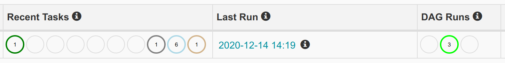

# 7. Run Pipeline

## 7.1 DAGs List


First time you open [Airflow UI](http://18.141.189.35:8080/admin/) home you will able to see table DAGs list. DAGs table has columns:

- First column is link to DAG detail
- Second column is for trigger `on/off` DAG. By default new created DAGs will have status `off`. To turn it `on` just click on the trigger.

  When DAG condition is `off` then DAG will never be scheduled, so task will never run.

- `DAG` contain DAG unique id and if clicked it will redirect to DAG detail page.
- `Schedule` contain argument `schedule_interval` declared on DAG.
- `Owner` contain owner of the DAG
- `Recent Task` contain recent tasks execution status
- `Last Run` is date time when DAG last run
- `DAG Runs` is how many DAG runs generated. Left circle show how many DAG succeed. Middle circle show how many DAG instance currently running. and Right cirle show how many DAG failed.
- `Link` is column contain action link for DAG. From left to right:
  - Link to run DAG manually
  - Link to view DAG task as tree
  - Link to view DAG task as graph
  - Link to view task duration visualization
  - Link to view task retry visualization
  - Link to view landing time visualization
  - Link to view gant chart from task execution
  - Link to view DAG code
  - Link to view DAG logs
  - Link to refresh DAG
  - Link to delete DAG

There are search box above table to search sepecific DAG. Keyword could be DAG id or owner.

**Execercise: Try filter and show your DAG only!**

## 7.2 Run DAG

To run dag, press link `trigger`  on `Links` column and watch what happen


Airflow will trigger `1 Dag Runs` and because in that specific DAG has `3 tasks` then there are exactly 3 task active in column `Recent Task`. But, you will notice after sometimes and refresh airflow seems stuck. Task status is not updated and `Dag Runs` still `1`


That happen because **DAG is still off**, to turn it on, change toggle on the left side of table


After `on` you will notice that task is starting run

 

But why DAG Runs become `3` even though you only click `trigger` once?

That happen because of this code:

```python
default_args = {
   'owner': owner,
   'depends_on_past': False,
   'start_date': days_ago(2),
   'email': ['airflow@example.com'],
   'email_on_failure': False,
   'email_on_retry': False,
   'retries': 1,
   'retry_delay': timedelta(minutes=5)
}
dag = DAG(
   f'{owner}.lesson1.excercise1',
   default_args=default_args,
   description='DAG simple pipeline',
   schedule_interval='@daily',
)
```

DAG has `start_date` 2 days ago and `schedule_interval=@daily`, so it generate 2 DAG runs

## 7.4 Check Run Result

After your pipeline running, running result will show in UI



As mention before column `Recent Task` is show recent task state


column `Last Run` showing when last time DAG run and column `Dag Runs` show dag running status.

### 7.4.1 Tree View (DAG Runs History)


DAG runs history could be viewed by click DAG id links on column `DAG` or treeview links on column `Links`


On the diagram left side is DAG task structure and on the right side is DAG run history. Each box on the right side respresent task run state.

As stated on above diagram box with dark green mean task executed successfully

When you click on the box airflow will show task modal dialog

<div style="text-align:center"></div>

Click Button `View Log` and will show run logs:

```
*** Reading local file: /home/ubuntu/airflow/logs/john_doe.lesson1.excercise1/print_date/2020-12-12T00:00:00+00:00/1.log
[2020-12-13 00:00:04,135] {taskinstance.py:655} INFO - Dependencies all met for <TaskInstance: john_doe.lesson1.excercise1.print_date 2020-12-12T00:00:00+00:00 [queued]>
[2020-12-13 00:00:04,143] {taskinstance.py:655} INFO - Dependencies all met for <TaskInstance: john_doe.lesson1.excercise1.print_date 2020-12-12T00:00:00+00:00 [queued]>
[2020-12-13 00:00:04,143] {taskinstance.py:866} INFO -
--------------------------------------------------------------------------------
[2020-12-13 00:00:04,143] {taskinstance.py:867} INFO - Starting attempt 1 of 2
[2020-12-13 00:00:04,143] {taskinstance.py:868} INFO -
--------------------------------------------------------------------------------
[2020-12-13 00:00:04,153] {taskinstance.py:887} INFO - Executing <Task(BashOperator): print_date> on 2020-12-12T00:00:00+00:00
[2020-12-13 00:00:04,156] {standard_task_runner.py:53} INFO - Started process 17715 to run task
[2020-12-13 00:00:04,201] {logging_mixin.py:112} INFO - Running %s on host %s <TaskInstance: john_doe.lesson1.excercise1.print_date 2020-12-12T00:00:00+00:00 [running]> ip-172-31-16-15.ap-southeast-1.compute.internal
[2020-12-13 00:00:04,213] {bash_operator.py:82} INFO - Tmp dir root location:
 /tmp
[2020-12-13 00:00:04,214] {bash_operator.py:105} INFO - Temporary script location: /tmp/airflowtmp_yrcjupv/print_dater6e5o0ac
[2020-12-13 00:00:04,214] {bash_operator.py:115} INFO - Running command: date
[2020-12-13 00:00:04,220] {bash_operator.py:122} INFO - Output:
[2020-12-13 00:00:04,222] {bash_operator.py:126} INFO - Sun Dec 13 00:00:04 UTC 2020
[2020-12-13 00:00:04,222] {bash_operator.py:130} INFO - Command exited with return code 0
[2020-12-13 00:00:04,229] {taskinstance.py:1048} INFO - Marking task as SUCCESS.dag_id=john_doe.lesson1.excercise1, task_id=print_date, execution_date=20201212T000000, start_date=20201213T000004, end_date=20201213T000004
[2020-12-13 00:00:14,132] {logging_mixin.py:112} INFO - [2020-12-13 00:00:14,132] {local_task_job.py:103} INFO - Task exited with return code 0
[2020-12-14 14:08:21,246] {taskinstance.py:655} INFO - Dependencies all met for <TaskInstance: john_doe.lesson1.excercise1.print_date 2020-12-12T00:00:00+00:00 [queued]>
[2020-12-14 14:08:21,253] {taskinstance.py:655} INFO - Dependencies all met for <TaskInstance: john_doe.lesson1.excercise1.print_date 2020-12-12T00:00:00+00:00 [queued]>
[2020-12-14 14:08:21,254] {taskinstance.py:866} INFO -
--------------------------------------------------------------------------------
[2020-12-14 14:08:21,254] {taskinstance.py:867} INFO - Starting attempt 1 of 2
[2020-12-14 14:08:21,254] {taskinstance.py:868} INFO -
--------------------------------------------------------------------------------
[2020-12-14 14:08:21,265] {taskinstance.py:887} INFO - Executing <Task(BashOperator): print_date> on 2020-12-12T00:00:00+00:00
[2020-12-14 14:08:21,268] {standard_task_runner.py:53} INFO - Started process 30183 to run task
[2020-12-14 14:08:21,313] {logging_mixin.py:112} INFO - Running %s on host %s <TaskInstance: john_doe.lesson1.excercise1.print_date 2020-12-12T00:00:00+00:00 [running]> ip-172-31-16-15.ap-southeast-1.compute.internal
[2020-12-14 14:08:21,326] {bash_operator.py:82} INFO - Tmp dir root location:
 /tmp
[2020-12-14 14:08:21,327] {bash_operator.py:105} INFO - Temporary script location: /tmp/airflowtmp9_pvaemj/print_date0lybqsrw
[2020-12-14 14:08:21,327] {bash_operator.py:115} INFO - Running command: date
[2020-12-14 14:08:21,332] {bash_operator.py:122} INFO - Output:
[2020-12-14 14:08:21,334] {bash_operator.py:126} INFO - Mon Dec 14 14:08:21 UTC 2020
[2020-12-14 14:08:21,334] {bash_operator.py:130} INFO - Command exited with return code 0
[2020-12-14 14:08:21,341] {taskinstance.py:1048} INFO - Marking task as SUCCESS.dag_id=john_doe.lesson1.excercise1, task_id=print_date, execution_date=20201212T000000, start_date=20201214T140821, end_date=20201214T140821
[2020-12-14 14:08:31,239] {logging_mixin.py:112} INFO - [2020-12-14 14:08:31,239] {local_task_job.py:103} INFO - Task exited with return code 0
[2020-12-14 14:19:53,449] {taskinstance.py:655} INFO - Dependencies all met for <TaskInstance: john_doe.lesson1.excercise1.print_date 2020-12-12T00:00:00+00:00 [queued]>
[2020-12-14 14:19:53,456] {taskinstance.py:655} INFO - Dependencies all met for <TaskInstance: john_doe.lesson1.excercise1.print_date 2020-12-12T00:00:00+00:00 [queued]>
[2020-12-14 14:19:53,456] {taskinstance.py:866} INFO -
--------------------------------------------------------------------------------
[2020-12-14 14:19:53,457] {taskinstance.py:867} INFO - Starting attempt 1 of 2
[2020-12-14 14:19:53,457] {taskinstance.py:868} INFO -
--------------------------------------------------------------------------------
[2020-12-14 14:19:53,466] {taskinstance.py:887} INFO - Executing <Task(BashOperator): print_date> on 2020-12-12T00:00:00+00:00
[2020-12-14 14:19:53,469] {standard_task_runner.py:53} INFO - Started process 31706 to run task
[2020-12-14 14:19:53,515] {logging_mixin.py:112} INFO - Running %s on host %s <TaskInstance: john_doe.lesson1.excercise1.print_date 2020-12-12T00:00:00+00:00 [running]> ip-172-31-16-15.ap-southeast-1.compute.internal
[2020-12-14 14:19:53,527] {bash_operator.py:82} INFO - Tmp dir root location:
 /tmp
[2020-12-14 14:19:53,528] {bash_operator.py:105} INFO - Temporary script location: /tmp/airflowtmph8v26i2u/print_dategmxireax
[2020-12-14 14:19:53,528] {bash_operator.py:115} INFO - Running command: date
[2020-12-14 14:19:53,533] {bash_operator.py:122} INFO - Output:
[2020-12-14 14:19:53,535] {bash_operator.py:126} INFO - Mon Dec 14 14:19:53 UTC 2020
[2020-12-14 14:19:53,536] {bash_operator.py:130} INFO - Command exited with return code 0
[2020-12-14 14:19:53,543] {taskinstance.py:1048} INFO - Marking task as SUCCESS.dag_id=john_doe.lesson1.excercise1, task_id=print_date, execution_date=20201212T000000, start_date=20201214T141953, end_date=20201214T141953
[2020-12-14 14:20:03,443] {logging_mixin.py:112} INFO - [2020-12-14 14:20:03,443] {local_task_job.py:103} INFO - Task exited with return code 0

```

### 7.4.2 Graph View

Graph view showing DAG task structure. It can be accessed by
menu `Graph View` on the left side of `Tree View`


Relation between graph view and tree view is


### 7.4.3 Task Duration

The duration of your different tasks over the past N runs. This view lets you find outliers and quickly understand where the time is spent in your DAG over many runs.


### 7.4.4 Task Tries

Task tries show how many tries each task doing over time


### 7.4.5 Landing Times

Landing times show how long your task wait for scheduled


### 7.4.5 Gantt Chart

The Gantt chart lets you analyse task duration and overlap. You can quickly identify bottlenecks and where the bulk of the time is spent for specific DAG runs.


### 7.4.6 Details

Detail show DAG detail configuration


### 7.4.7 Code View

Transparency is everything. While the code for your pipeline is in source control, this is a quick way to get to the code that generates the DAG and provide yet more context.


## 7.5 Exercise Time
