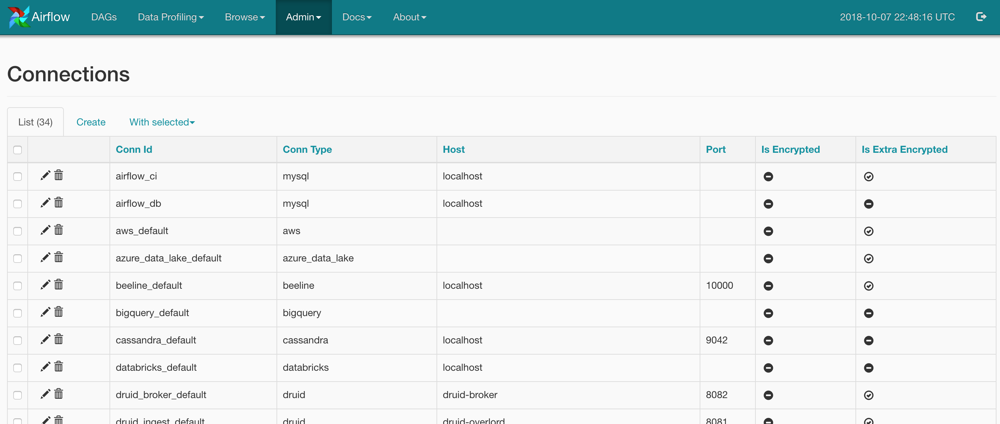
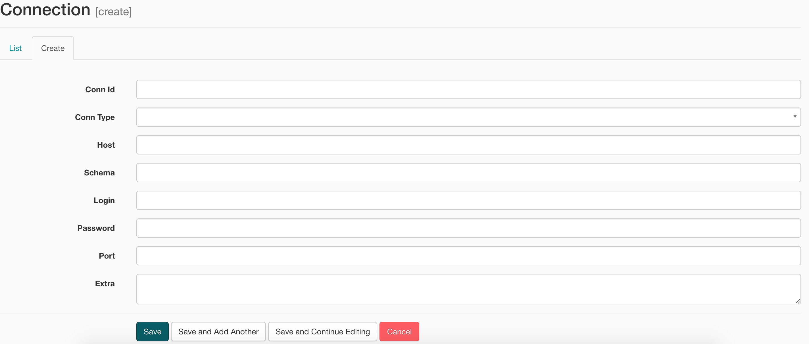
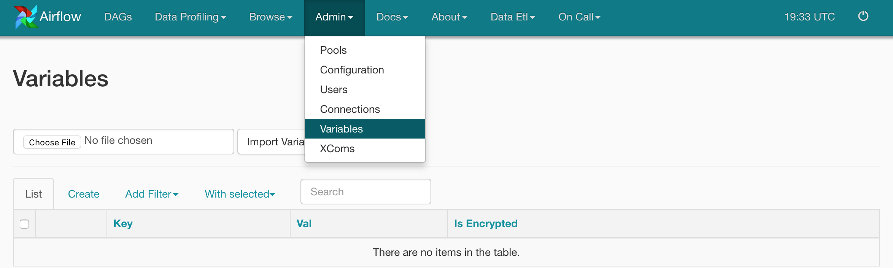

# Advance Airflow Concepts

### Airflow Hooks:

Hooks meant as an interface to interact with external systems. Hooks handle the connection and interaction to specific instances of these systems, and expose consistent methods to interact with them.

Some of the inbuild hooks are,

- HiveHook
- mysql
- mssql
- oracle
- http
- Slack

#### Custom Hook:

extend `BaseHook` class and override `get_conn`, `get_records`, `run` methods as needed

### Connections:

Connections store information about different external data sources instances connection information. The idea here is that scripts use references to database instances (conn_id) instead of hard-coding hostname, logins and passwords when using operators or hooks.

#### Airflow connections via Airflow UI

##### List all the connections:



##### Create a new connection:



#### Airflow connections via environment variable (Recommended):

Airflow will consider any environment variable with the prefix `AIRFLOW_CONN`. (e.g) to set `S3_DEFAULT` connection, you can set the environment variable `AIRFLOW_CONN_S3_DEFAULT`

### Variables:

Variables are a generic way to store and retrieve arbitrary content or settings as a simple key-value store within Airflow.It is useful to set environment variable to pass across the pipeline.



Apart from UI, we can set environment variable programmatically as well,

```python
from airflow.models import Variable
Variable.set("foo","value")
foo = Variable.get("foo")
Variable.set("bar",'{ "name":"John", "age":30, "city":"New York"}') # set json as a value
bar = Variable.get("bar", deserialize_json=True) # deserialize json value
```
