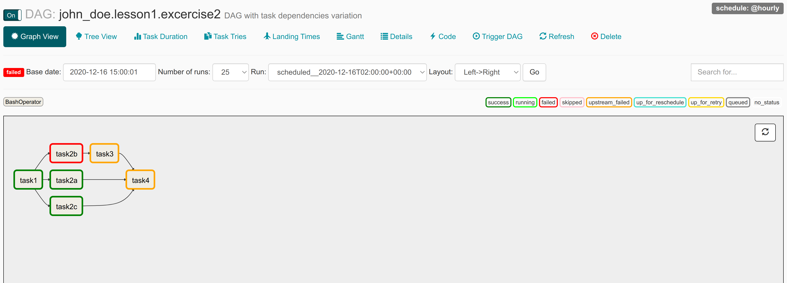
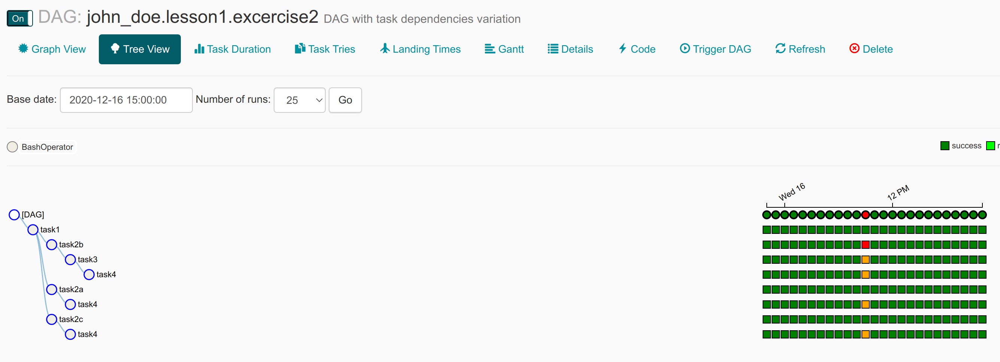
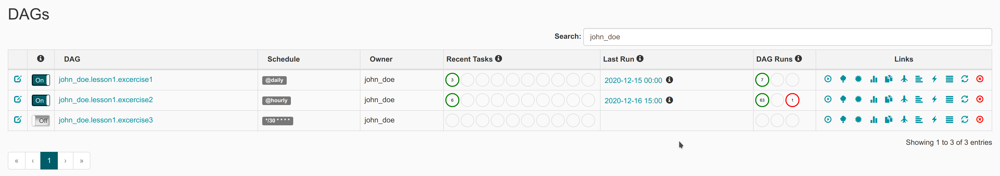
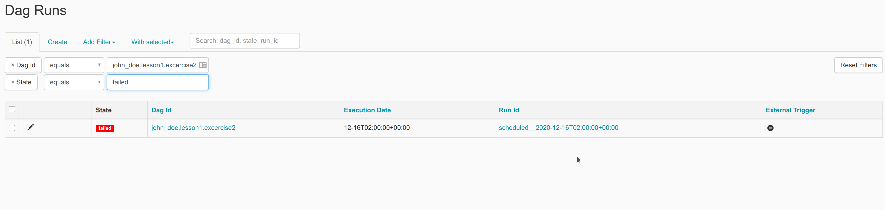
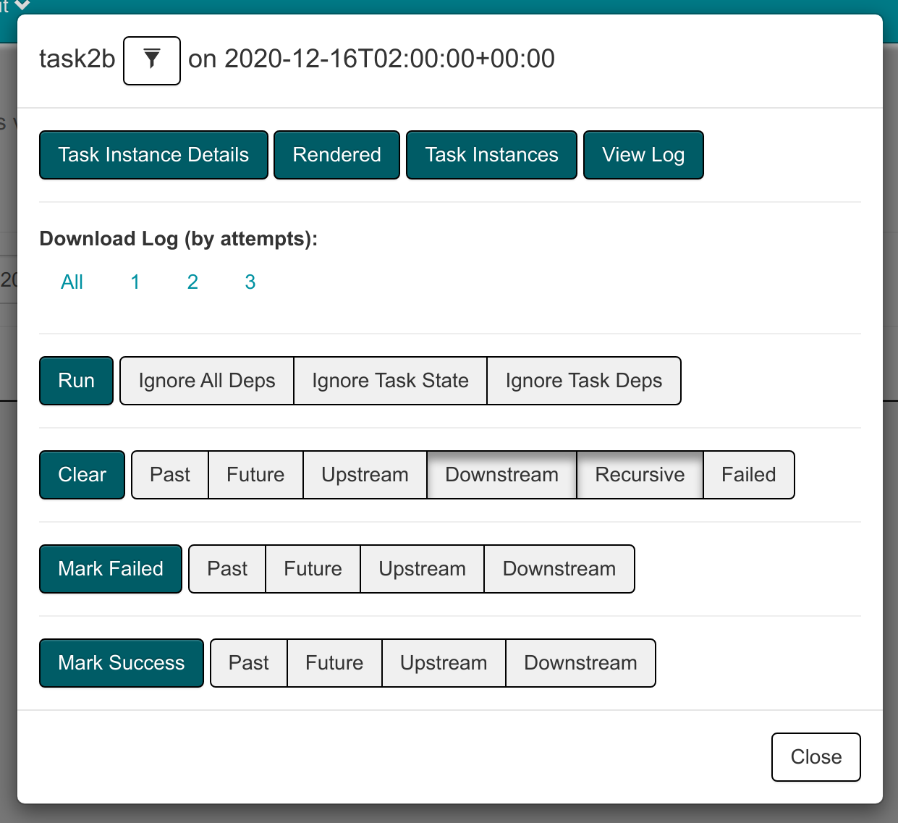
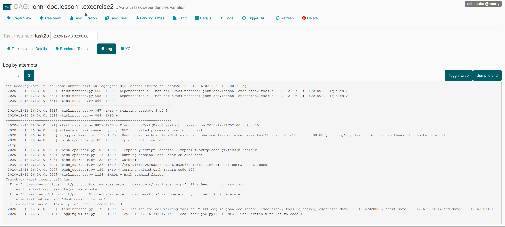
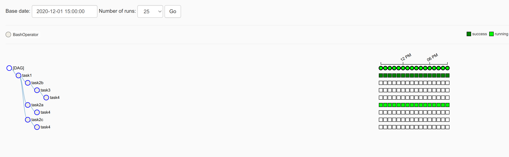

# 9. Failing Task and Backfilling

## 9.1 Failing Task

It’s not uncommon for tasks to fail, which could be for a multitude of reasons (e.g., an external service being down, network connectivity issues or a broken disk)





### 9.1.1 Simulate Failed DAG

In our scenario we forgot typo after edit DAG. Copy your python file `lesson1.exercise2.py` to `lesson2.exercise1.py`

```python
t2b = BashOperator(
    task_id='task2b',
    bash_command='echo "task 2b executed"',
    dag=dag,
)
```

Edit bash command to `eco "task 2b executed"` so t2b become this:

```python
t2b = BashOperator(
    task_id='task2b',
    bash_command='eco "task 2b executed"',
    dag=dag,
)
```

Then try trigger your DAG.

### 9.1.2 Debug It

If there are failed DAG then it will showed on home page



Click **Red Circle** on column **DAG Runs** and you will directed to list of dag runs error page



and when your click link on column **Run Id** then it will direct you to graph page


it show that DAG failed because `t2b` is failed and its downstream is not executed.

To know what happen you could click on the failed task box



Click buton **View Log** and it will show task run instance log



### 9.1.3 Fix It

Fix your DAG code then refresh DAG by click refresh button then back to task `t2b` task instance dialog


click **Clear** button to retry failed task.

To clear multiple task at once you could use command:

```bash
airflow clear -s [START_DATE] -e [END_DATE] -t [TASK_REGEX] [DAG_ID]
```

example clear whole DAG:

```bash
airflow clear -s 2020-12-01 -e 2020-12-02 john_doe.lesson1.excercise2
```

example clear specific task:

```bash
airflow clear -s 2020-12-01 -e 2020-12-02 -t t2b john_doe.lesson1.excercise2
```

## 9.2 Backfilling

### 9.2.1 Disable Backfilling

By default, Airflow will schedule and run any past schedule intervals that have not yet been
run. As such, specifying a past start date and activating the corresponding DAG will result in
all intervals that have passed before the current time being executed. This behaviour is
controlled by the DAG catchup parameter and can be disabled by setting catchup to False

```python
dag = DAG(
    f'{owner}.lesson1.excercise2',
    default_args=default_args,
    description='DAG with task dependencies variation',
    start_date=dt.datetime(year=2019, month=1, day=1),
    catchup=False,
)
```

### 9.2.2 Manual Backfilling

Sometimes there are need to run DAG past in time. You can do that by command:

```bash
airflow backfill -s [START_DATE] -e [END_DATE] [DAG_ID]
```

here is the example:

```bash
airflow backfill -s 2020-12-01 -e 2020-12-02 john_doe.lesson1.excercise2
```

Airflow then will create DAG runs based on that start and end date



## 9.3 Depend On Past

Copy file `./exercises/lesson2.exercise2.py` to your workspace.
At a glance this code is same with `lesson1.exercise2.py` but task `t2b` is different

```python
t2b = BashOperator(
    task_id='task2b',
    bash_command='echo "task 2b executed"',
    dag=dag,
    depends_on_past=True,
    wait_for_downstream=True,
)
```

there are arguments `depends_on_past=True` and `wait_for_downstream=True`. Argument `depends_on_past=True` means this task will wait previeous task in previous dag runs to finish first then executed. and `wait_for_downstream=True` means current task `t2b` will wait previous task `t2b` downstream to finish first.
