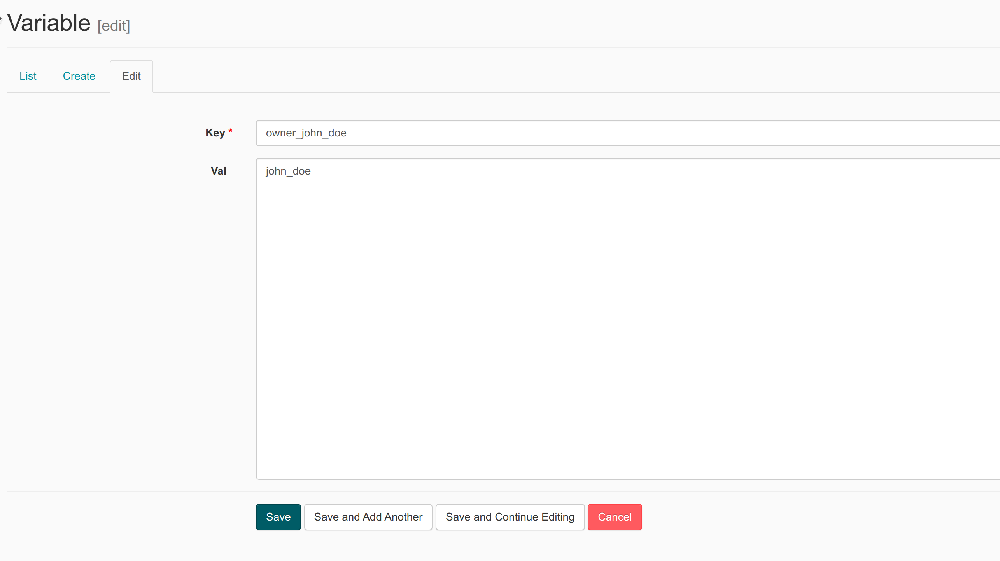

## Lesson 2 Exercise 7

**Instructions:**
create airflow variable through web ui then
replace owner below using variable from airflow

### Create Variable

Open [airflow web UI](http://18.141.189.35:8080/) then navigate to menu `Admin` > `Variables` then click tab `Create`

Fill `Key` and `Value` as required



Then click save.

### Call variable

To call variable in airflow you need to import `Variable` module first

```python
from airflow.models import Variable
```

then get your owner from variable

```python
owner = Variable.get("owner_john_doe")
```

### Complete Code Solution

```python
import datetime
import logging

from airflow import DAG
from airflow.operators.python_operator import PythonOperator
from airflow.utils.dates import days_ago
from airflow.models import Variable


owner = Variable.get("owner_john_doe") # Replace with your short name

default_args = {
    'owner': owner,
    'depends_on_past': False,
    'start_date': days_ago(2),
}

dag = DAG(
    f'{owner}.lesson2.excercise7',
    default_args=default_args,
)

greet_task = PythonOperator(
    task_id="say_hello",
    python_callable=say_hello,
    op_kwargs={'log_to_write': f'Hi {owner} greeting from airflow'},
    dag=dag,
)

bye_task = PythonOperator(
    task_id="say_hello",
    python_callable=say_hello,
    op_kwargs={'log_to_write': 'Good bye'},
    dag=dag,
)

greet_task >> bye_task
```
