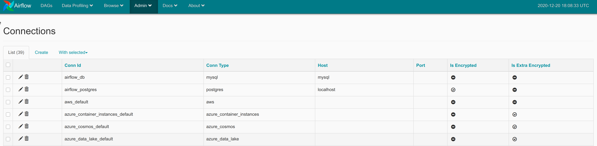
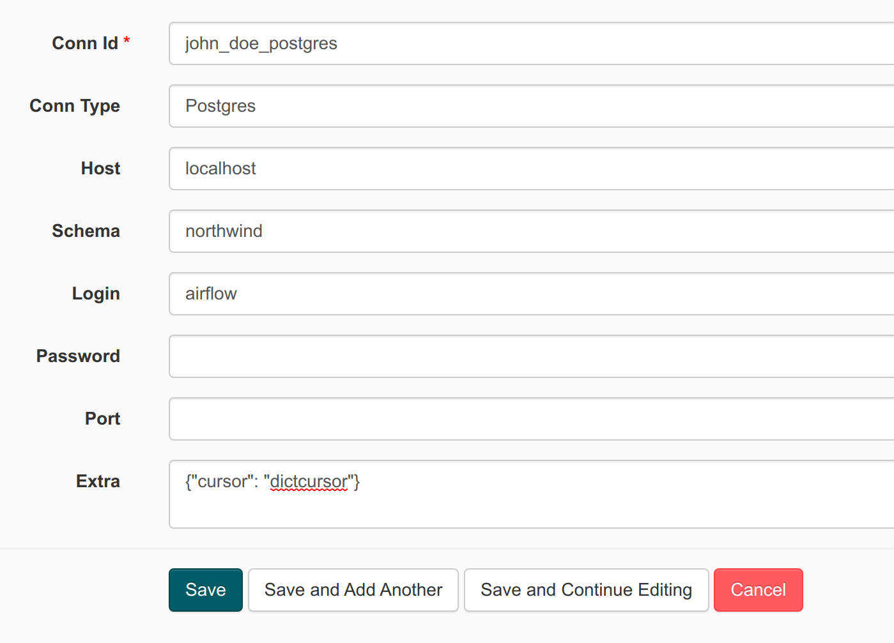
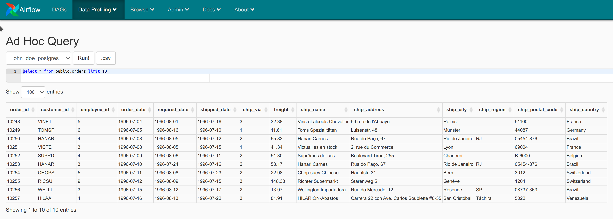

# 13. PostgreSQL by Example

We use postgresql because postgresql is one of most popular open source DBMS available and basically redshift is [based on postgresql](https://docs.aws.amazon.com/redshift/latest/dg/c_redshift-and-postgres-sql.html). Hopefully when we start using redshift there are no technical difficulties.

## <a name="setup-connection"></a>13.1 Setup Connection

As mentioned before, if we want to communicate with external system in airflow then we will use **Hook** and airflow has official PostgreSQL hook module from package `airflow.hooks.postgres_hook`.

To use hook we need to setup connection configuration first. Open menu `Admin` > `Connections`



then click tab **Create** and fill credentials



**NB: Change Conn Id to your unique name**

username/password `airflow`/`airflow` and don't forget add this code to field `extra`:

```json
{ "cursor": "dictcursor" }
```

To validate your newly created connection go to menu `Data Profiling` > `Ad Hoc Query`

Choose connection id that you created then type query:

```sql
select * from public.orders limit 10
```

if your connection is valid then it should return the result



## 13.2 Read Data

Here is example how to read data from postgresql

```python
from datetime import timedelta

from airflow import DAG
from airflow.utils.dates import days_ago
from airflow.operators.bash_operator import BashOperator
from airflow.operators.python_operator import PythonOperator
from airflow.hooks.postgres_hook import PostgresHook

owner = 'john_doe' # Replace with your short name

default_args = {
    'owner': owner,
    'depends_on_past': False,
    'start_date': days_ago(2),
}

dag = DAG(
    f'{owner}.lesson3.excercise1',
    default_args=default_args,
    description='Read data from postgresql',
    schedule_interval=None,
)

def read_data():
  db_conn = PostgresHook(postgres_conn_id='john_doe_postgres')
  result = db_conn.get_records('select * from public.orders limit 10')
  for row in result:
    logging.info(row)


read_task = PythonOperator(
    task_id="read",
    python_callable=read_data,
    dag=dag
)
```

## 13.2 Migrate Data

Open vscode terminal and type

```bash
psql -h localhost -d northwind2 -U airflow -W
```

and type password `airflow`

Create new table with name DDL query:

```sql
CREATE TABLE john_doe_orders (
    order_id smallint NOT NULL PRIMARY KEY,
    customer_id bpchar,
    employee_id smallint,
    order_date date,
    required_date date,
    shipped_date date,
    ship_via smallint,
    freight real,
    ship_name character varying(40),
    ship_address character varying(60),
    ship_city character varying(15),
    ship_region character varying(15),
    ship_postal_code character varying(10),
    ship_country character varying(15)
);
```

Don't forget change `john_doe` to your name

Create new connection with same creds in [setup connection section](#setup-connection) but change connection id to different id and schema field to `northwind2`

```python
from datetime import timedelta
import logging

from airflow import DAG
from airflow.utils.dates import days_ago
from airflow.operators.bash_operator import BashOperator
from airflow.operators.python_operator import PythonOperator
from airflow.hooks.postgres_hook import PostgresHook

owner = 'john_doe' # Replace with your short name

default_args = {
    'owner': owner,
    'depends_on_past': False,
    'start_date': days_ago(2),
}

dag = DAG(
    f'{owner}.lesson3.excercise2',
    default_args=default_args,
    description='Read data from postgresql',
    schedule_interval=None,
)

def migrate_data():
  src_conn = PostgresHook(postgres_conn_id='john_doe_postgres')
  dest_conn = PostgresHook(postgres_conn_id='john_doe_postgres2')
  result = src_conn.get_records('select * from public.orders limit 10')
  insert_sql = f"""
    INSERT INTO public.{owner}_orders(order_id,customer_id,employee_id,order_date,required_date,shipped_date,ship_via,freight,ship_name,ship_address,ship_city,ship_region,ship_postal_code,ship_country)
    VALUES(%s,%s,%s,%s,%s,%s,%s,%s,%s,%s,%s,%s,%s,%s);
  """
  for row in result:
    logging.info(insert_sql)
    dest_conn.run(insert_sql, parameters=(row['order_id'],row['customer_id'],row['employee_id'],row['order_date'],row['required_date'],row['shipped_date'],row['ship_via'],row['freight'],row['ship_name'],row['ship_address'],row['ship_city'],row['ship_region'],row['ship_postal_code'],row['ship_country']))

migrate_task = PythonOperator(
    task_id="migrate",
    python_callable=migrate_data,
    dag=dag
)
```

Is your DAG run succeed? then what about second run?

On the second run you will face this error

```
ERROR - duplicate key value violates unique constraint "orders_pkey"
```

That happen because code above is not idempotent. Remember avoid using only INSERT and try using UPSERT.

Change INSERT SQL above to become like this

```sql
INSERT INTO public.{owner}_orders(order_id,customer_id,employee_id,order_date,required_date,shipped_date,ship_via,freight,ship_name,ship_address,ship_city,ship_region,ship_postal_code,ship_country)
VALUES(%s,%s,%s,%s,%s,%s,%s,%s,%s,%s,%s,%s,%s,%s)
ON CONFLICT (order_id)
DO NOTHING;
```

## 13.3 PostgreSQL Operator

```python
from datetime import timedelta
import logging

from airflow import DAG
from airflow.utils.dates import days_ago
from airflow.operators.bash_operator import BashOperator
from airflow.operators.postgres_operator import PostgresOperator
from airflow.operators.python_operator import PythonOperator
from airflow.hooks.postgres_hook import PostgresHook

owner = 'john_doe' # Replace with your short name

default_args = {
    'owner': owner,
    'depends_on_past': False,
    'start_date': days_ago(2),
}

dag = DAG(
    f'{owner}.lesson3.excercise3',
    default_args=default_args,
    description='Read data from postgresql using postgresqloperator',
    schedule_interval=None,
)

write_to_postgres = PostgresOperator(
    task_id="write_to_postgres",
    postgres_conn_id="john_doe_postgres2",
    sql=f"""
    INSERT INTO public.{owner}_orders VALUES
    (10248, 'VINET', 5, '1996-07-04', '1996-08-01', '1996-07-16', 3, 32.3800011, 'Vins et alcools Chevalier', '59 rue de l''Abbaye', 'Reims', NULL, '51100', 'France'),
    (10249, 'TOMSP', 6, '1996-07-05', '1996-08-16', '1996-07-10', 1, 11.6099997, 'Toms Spezialitäten', 'Luisenstr. 48', 'Münster', NULL, '44087', 'Germany'),
    (10250, 'HANAR', 4, '1996-07-08', '1996-08-05', '1996-07-12', 2, 65.8300018, 'Hanari Carnes', 'Rua do Paço, 67', 'Rio de Janeiro', 'RJ', '05454-876', 'Brazil'),
    (10251, 'VICTE', 3, '1996-07-08', '1996-08-05', '1996-07-15', 1, 41.3400002, 'Victuailles en stock', '2, rue du Commerce', 'Lyon', NULL, '69004', 'France'),
    (10252, 'SUPRD', 4, '1996-07-09', '1996-08-06', '1996-07-11', 2, 51.2999992, 'Suprêmes délices', 'Boulevard Tirou, 255', 'Charleroi', NULL, 'B-6000', 'Belgium'),
    (10253, 'HANAR', 3, '1996-07-10', '1996-07-24', '1996-07-16', 2, 58.1699982, 'Hanari Carnes', 'Rua do Paço, 67', 'Rio de Janeiro', 'RJ', '05454-876', 'Brazil'),
    (10254, 'CHOPS', 5, '1996-07-11', '1996-08-08', '1996-07-23', 2, 22.9799995, 'Chop-suey Chinese', 'Hauptstr. 31', 'Bern', NULL, '3012', 'Switzerland'),
    (10255, 'RICSU', 9, '1996-07-12', '1996-08-09', '1996-07-15', 3, 148.330002, 'Richter Supermarkt', 'Starenweg 5', 'Genève', NULL, '1204', 'Switzerland'),
    (10256, 'WELLI', 3, '1996-07-15', '1996-08-12', '1996-07-17', 2, 13.9700003, 'Wellington Importadora', 'Rua do Mercado, 12', 'Resende', 'SP', '08737-363', 'Brazil'),
    (10257, 'HILAA', 4, '1996-07-16', '1996-08-13', '1996-07-22', 3, 81.9100037, 'HILARION-Abastos', 'Carrera 22 con Ave. Carlos Soublette #8-35', 'San Cristóbal', 'Táchira', '5022', 'Venezuela'),
    (10258, 'ERNSH', 1, '1996-07-17', '1996-08-14', '1996-07-23', 1, 140.509995, 'Ernst Handel', 'Kirchgasse 6', 'Graz', NULL, '8010', 'Austria'),
    (10259, 'CENTC', 4, '1996-07-18', '1996-08-15', '1996-07-25', 3, 3.25, 'Centro comercial Moctezuma', 'Sierras de Granada 9993', 'México D.F.', NULL, '05022', 'Mexico')
    ON CONFLICT (order_id)
    DO NOTHING;
    """,
    dag=dag,
)

write_to_postgres2 = PostgresOperator(
    task_id="write_to_postgres2",
    postgres_conn_id="john_doe_postgres2",
    sql="lesson3.exercise3.sql",
    dag=dag,
)
```

Above code is example how to use PostgreOperator. Task `write_to_postgres` demonstrate using inline query and task `write_to_postgres2` demonstrate using file.
