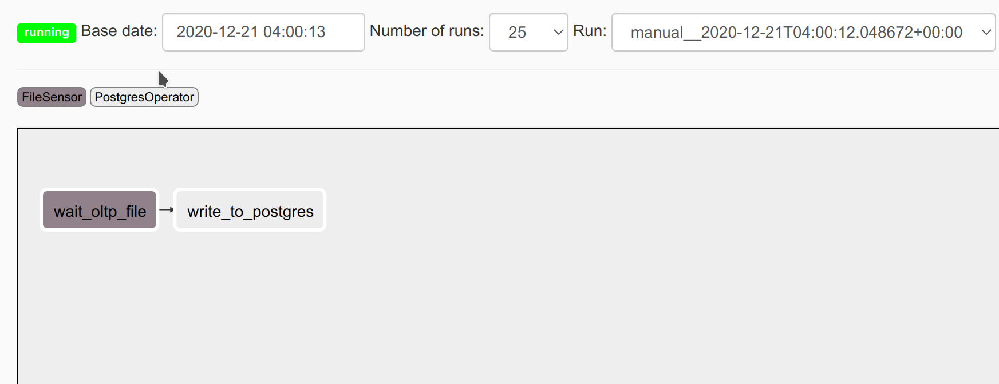

# 14. Sensor by Examples

Sensor is special type (subclass)
of operators. Sensors continuously poll for certain conditions to be true, and succeed if so. If
false, the sensor will wait and try again until either the condition is true, or a timeout is
eventually reached

## 14.1 Use Case Scenario

Imagine a OLTP system delivering a daily dump of its data on a shared storage system between your OLAP system and the
OLTP system. You have to ingest daily dump file to your OLAP system.

The problem is, OLTP dump process is not always on time. It depends on how large data that day and network latency. And you troubled to decide when to start job.

Here is use case sensor come to the rescue

## 14.2 Sensor Declaration

Here is how we declare sensor

```python
from airflow.contrib.sensors.file_sensor import FileSensor

wait_oltp_file = FileSensor(
    task_id="wait_oltp_file",
    filepath="lesson3.exercise4.sql",
    dag=dag,
)
```

then we declare ingestion task

```python
write_to_postgres = PostgresOperator(
    task_id="write_to_postgres",
    postgres_conn_id="john_doe_postgres2",
    sql="lesson3.exercise4.sql",
    dag=dag,
)
```

and set ingestion task to depends on sensor

```python
wait_oltp_file >> write_to_postgres
```

## 14.3 Complete Code

```python
# Instruction:
# Run this DAG twice or more
#

from datetime import timedelta
import logging

from airflow import DAG
from airflow.utils.dates import days_ago
from airflow.operators.postgres_operator import PostgresOperator
from airflow.contrib.sensors.file_sensor import FileSensor


owner = 'john_doe' # Replace with your short name

default_args = {
    'owner': owner,
    'depends_on_past': False,
    'start_date': days_ago(2),
}

dag = DAG(
    f'{owner}.lesson3.excercise4',
    default_args=default_args,
    description='Read data from postgresql using postgresqloperator',
    schedule_interval=None,
)

wait_oltp_file = FileSensor(
    task_id="wait_oltp_file",
    filepath="lesson3.exercise4.sql",
    dag=dag,
)

write_to_postgres = PostgresOperator(
    task_id="write_to_postgres",
    postgres_conn_id="john_doe_postgres2",
    sql="lesson3.exercise4.sql",
    dag=dag,
)

wait_oltp_file >> write_to_postgres
```

DAG should become like this:



Task `wait_oltp_file` will continue run until file checked is exist or timeout. If file exist then run task write_to_postgres and if timeout then will raise error and mark task `write_to_postgres` status to `upstream_failed`

## 14.4 Other Sensors

There are many type sensor is available officially in airflow:

- airflow.sensors.base
- airflow.sensors.base_sensor_operator
- airflow.sensors.bash
- airflow.sensors.date_time
- airflow.sensors.date_time_sensor
- rflow.sensors.external_task
- airflow.sensors.external_task_sensor
- airflow.sensors.filesystem
- airflow.sensors.hdfs_sensor
- airflow.sensors.hive_partition_sensor
- airflow.sensors.http_sensor
- airflow.sensors.metastore_partition_sensor
- airflow.sensors.named_hive_partition_sensor
- airflow.sensors.python
- airflow.sensors.s3_key_sensor
- airflow.sensors.s3_prefix_sensor
- airflow.sensors.smart_sensor
- airflow.sensors.sql
- airflow.sensors.sql_sensor
- airflow.sensors.time_delta
- airflow.sensors.time_delta_sensor
- airflow.sensors.time_sensor
- airflow.sensors.web_hdfs_sensor
- airflow.sensors.weekday
