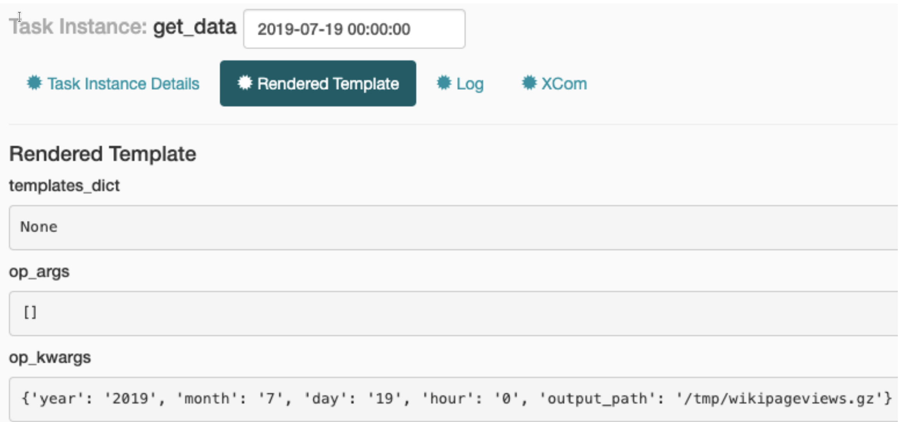

# 15. Templating and Airflow Context

## 15.1 What is available for templating?

Now that we understand which arguments of an operator can be templated, which variables do
we have at our disposal for templating? We’ve seen `execution_date` or `ti` used before in a number
of examples, but more variables are available. With the help of the PythonOperator, we can
print the full task context and inspect it:

```python
def _print_context(**kwargs):
  print(kwargs)

print_context = PythonOperator(
  task_id="print_context",
  python_callable=_print_context,
  provide_context=True,
  dag=dag,
)
```

All variables are **captured** in `**kwargs` and passed to the print() function. All these
variables are available to us at runtime. The following table provides a description of all
available task context variables:

| Variable                            | Description                                                                                                                                          |
| ----------------------------------- | ---------------------------------------------------------------------------------------------------------------------------------------------------- |
| `{{ ds }}`                          | the execution date as `YYYY-MM-DD`                                                                                                                   |
| `{{ ds_nodash }}`                   | the execution date as `YYYYMMDD`                                                                                                                     |
| `{{ prev_ds }}`                     | the previous execution date as `YYYY-MM-DD` if `{{ ds }}` is `2018-01-08` and `schedule_interval` is `@weekly`, `{{ prev_ds }}` will be `2018-01-01` |
| `{{ prev_ds_nodash }}`              | the previous execution date as `YYYYMMDD` if exists, else `None`                                                                                     |
| `{{ next_ds }}`                     | the next execution date as `YYYY-MM-DD` if `{{ ds }}` is `2018-01-01` and `schedule_interval` is `@weekly`, `{{ next_ds }}` will be `2018-01-08`     |
| `{{ next_ds_nodash }}`              | the next execution date as `YYYYMMDD` if exists, else `None`                                                                                         |
| `{{ yesterday_ds }}`                | the day before the execution date as `YYYY-MM-DD`                                                                                                    |
| `{{ yesterday_ds_nodash }}`         | the day before the execution date as `YYYYMMDD`                                                                                                      |
| `{{ tomorrow_ds }}`                 | the day after the execution date as `YYYY-MM-DD`                                                                                                     |
| `{{ tomorrow_ds_nodash }}`          | the day after the execution date as `YYYYMMDD`                                                                                                       |
| `{{ ts }}`                          | same as `execution_date.isoformat()`. Example: `2018-01-01T00:00:00+00:00`                                                                           |
| `{{ ts_nodash }}`                   | same as `ts` without `-`, `:` and TimeZone info. Example: `20180101T000000`                                                                          |
| `{{ ts_nodash_with_tz }}`           | same as `ts` without `-` and `:`. Example: `20180101T000000+0000`                                                                                    |
| `{{ execution_date }}`              | the execution*date (logical date) (`pendulum.Pendulum`*)                                                                                             |
| `{{ prev_execution_date }}`         | the previous execution date (if available) (`pendulum.Pendulum`\_)                                                                                   |
| `{{ prev_execution_date_success }}` | execution date from prior successful dag run (if available) (`pendulum.Pendulum`\_)                                                                  |
| `{{ prev_start_date_success }}`     | start date from prior successful dag run (if available) (`pendulum.Pendulum`\_)                                                                      |
| `{{ next_execution_date }}`         | the next execution date (`pendulum.Pendulum`\_)                                                                                                      |
| `{{ dag }}`                         | the DAG object                                                                                                                                       |
| `{{ task }}`                        | the Task object                                                                                                                                      |
| `{{ macros }}`                      | a reference to the macros package, described below                                                                                                   |
| `{{ task_instance }}`               | the task_instance object                                                                                                                             |
| `{{ end_date }}`                    | same as `{{ ds }}`                                                                                                                                   |
| `{{ latest_date }}`                 | same as `{{ ds }}`                                                                                                                                   |
| `{{ ti }}`                          | same as `{{ task_instance }}`                                                                                                                        |
| `{{ params }}`                      | a reference to the user-defined params dictionary which can be overridden by                                                                         |

## 15.2 Templating the BashOperator

```python
print_template =  BashOperator(
    task_id="print_template",
    bash_command='echo "execution date is {{ ts }} with year {{ execution_date.year }} and month {{ \'{:02}\'.format(execution_date.month) }}"',
    dag=dag,
)
```

To call template variable in bash operator just use `{{ variable }}`

## 15.3 Templating the PythonOperator

The PythonOperator is an exception to the templating shown in the previous section. With the
BashOperator (and all other operators in Airflow), you provide a string to the bash_command
argument (or whatever the argument is named in other operators), which is automatically
templated at runtime. The PythonOperator is an exception to this standard, because it doesn’t
take arguments which can be templated with the runtime context, but instead a
python_callable argument in which the runtime context can be applied.

we must set an argument `provide_context=True` in order to
provide the task instance context. Running the PythonOperator without setting `provide_context=True` will execute the callable fine but no task context variables will be passed to the callable function.

```python
def _print_context(**kwargs):
  ts = kwargs['ts']
  execution_date = kwargs['execution_date']
  year, month, *_ = execution_date.timetuple()
  loggin.info(f'execution date is {ts} with year {year} and month {month:02}')

print_context = PythonOperator(
  task_id="print_context",
  python_callable=_print_context,
  provide_context=True,
  dag=dag,
)
```

`kwargs` is variable commonly used in python. But like other variables it could be replaced with other names for example `context` or anything else.

```python
def _print_context(**context):
  ts = context['ts']
  execution_date = context['execution_date']
  year, month, *_ = execution_date.timetuple()
  loggin.info(f'execution date is {ts} with year {year} and month {month:02}')
```

The most important is syntax `**` that means gather all arguments in one variables. It could also directly declared arguments

```python
def _print_context(ts, execution_date, **others):
  year, month, *_ = execution_date.timetuple()
  loggin.info(f'execution date is {ts} with year {year} and month {month:02}')
```

## 15.4 Providing variables to the PythonOperator

Besides built in variable or we called it context. We still able to declare our variable ourself with options `op_args` and `op_kwargs`

for example op_args:

```python
def _print_context(newvar, **kwargs):
  ts = kwargs['ts']
  execution_date = kwargs['execution_date']
  year, month, *_ = execution_date.timetuple()

  logging.info(f'Hello {newvar}')
  logging.info(f'execution date is {ts} with year {year} and month {month:02}')

print_context = PythonOperator(
  task_id="print_context",
  python_callable=_print_context,
  dag=dag,
  provide_context=True,
  op_args=["Good day sir"],
)
```

for example op_kwargs:

```python
def _print_context(newvar, **kwargs):
  ts = kwargs['ts']
  execution_date = kwargs['execution_date']
  year, month, *_ = execution_date.timetuple()

  logging.info(f'Hello {newvar}')
  logging.info(f'execution date is {ts} with year {year} and month {month:02}')

print_context = PythonOperator(
  task_id="print_context",
  python_callable=_print_context,
  dag=dag,
  provide_context=True,
  op_kwargs={"newvar": "Good day sir"},
)
```

## 15.5 Inspecting templated arguments

Click one of task instance then click button `Rendered`


