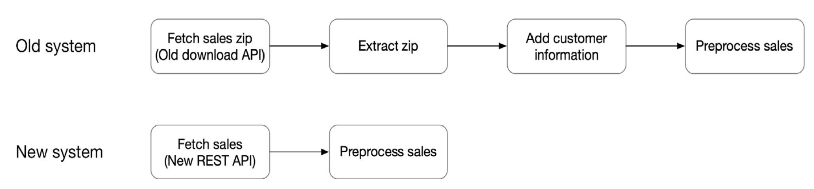
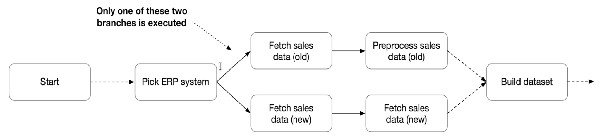

# 18. Branching

Imagine that you just finished writing the ingestion of order data in your DAG, when your co-worker comes in with some news. Apparently management decided that they are going to
switch calculation logic, which means that our order data will be have different logic (and of course in a different format).

Of course, this change should not result in any disruption in the training our model. Moreover, they would like us to keep our flow compatible with both the old and new calculation logic, so that we can continue to use historical order data in our future analyses.

For our convinience, we will differentiate calculation based on `execution_date`:

- If `execution_date` is odd like `2020-12-01` then there are no change on data count
- If `execution_date` is even like `2020-12-02` then data count will multiply by 2

## 18.1 Branching within tasks

One approach could be to rewrite our order ingestion tasks to check the current execution date and use that to decide between two separate code paths for ingesting and processing the order
data.

For example, we could rewrite our migrate data task to something like this

```python
def migrate_odd_day(ds, **kwargs):
  # migrate on odd day

def migrate_even_day(ds, **kwargs):
  # migrate on even day


def migrate_data(**kwargs):
  execution_date = kwargs['execution_date']
  if execution_date.day % 2 == 0:
    migrate_even_day(**kwargs)
  else:
    migrate_odd_day(**kwargs)
```

An advantage of this approach is that it allows us to incorporate some flexibility in our DAGs without having to modify the structure of the DAG itself. However, this approach only works in cases where the branches in our code consist of similar tasks.

If there are case when two branches have different set of task like this:



At that case we may be better off splitting our
data ingestion into two separate sets of tasks.

Another drawback of this approach is that it is difficult to see which code branch is being used by Airflow during a specific DAG run.

## 18.2 Branching within the DAG

Another way to support the two different systems in a single DAG is to develop two distinct sets of tasks (one for each system) and allow the DAG to choose whether to execute the tasks for fetching data from either the old or new system



We could your module `BranchPythonOperator`

```python
from airflow.operators.python_operator import BranchPythonOperator

def _pick_migration(**kwargs):
  execution_date = kwargs['execution_date']
  if execution_date.day % 2 == 0:
    return 'migrate_even' # returning task id `migrate_even_task`
  else:
    return 'migrate_odd' # returning task id `migrate_odd_task`


migration_branch = BranchPythonOperator(
  task_id='migration_branch',
  provide_context=True,
  python_callable=_pick_migration,
  dag=dag
)

migration_branch >> [migrate_even_task, migrate_odd_task]

```
