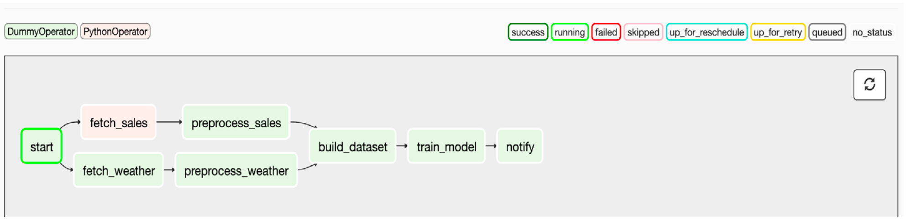

# 19. Triggering Rules

Trigger rules are essentially the conditions that Airflow applies to tasks to determine whether they are ready to execute, as a function of their dependencies

## 19.1 Short Example

1. Airflow starts executing our DAG by first running the start task
2. Once the start task has been completed successfully, the fetch_weather and
   fetch_sales tasks become ready for execution, as their only dependency now satisfies their
   trigger rule. By following this pattern of execution, Airflow can continue executing the remaining tasks in the DAG until the entire DAG has been executed

## 19.2 What if failure happen?

Task failure affects downstream tasks is often referred to as ‘propagation’, as in this case the upstream failure is ‘propagated’ to the downstream tasks. Besides failures, the effects of skipped tasks can also be propagated
downstream by the default trigger rule, resulting in all tasks downstream of a skipped task
also being skipped.

To avoid that happen then on downstream task you could set `trigger_rule='one_success'`

## 19.2 Other Trigger Rule

| Trigger Rule          | Behaviour                                                                                                     | Example Use Case                                                                                                                  |
| --------------------- | ------------------------------------------------------------------------------------------------------------- | --------------------------------------------------------------------------------------------------------------------------------- |
| all_success (default) | Triggers when all parent tasks have completed successfully.                                                   | The default trigger rule for a normal workflow.                                                                                   |
| all_failed            | Triggers when all parent tasks have failed (or have failed as a result of a failure in their parents).        | Trigger error handling code in situations where you expected at least one success amongst a group of tasks.                       |
| all_done              | Triggers when all parents are done with their execution, regardless of the their resulting state.             | Execute clean-up code that you want to execute when all tasks have finished (e.g. shutting down a machine or stopping a cluster). |
| one_failed            | Triggers as soon as at least one parent has failed, does not wait for other parent tasks to finish executing. | Quickly trigger some error handling code, such as notifications or rollbacks.                                                     |
| one_success           | Triggers as soon as one parent succeeds, does not wait for other parent tasks to finish executing.            | Quickly trigger downstream computations/notifications as soon as one result becomes available.                                    |
| none_failed           | Triggers if no parents have failed, but have either completed successfully or been skipped.                   | Joining conditional branches in Airflow DAGs.                                                                                     |
| none_skipped          | Triggers if no parents have been skipped, but have either completed successfully or failed.                   | ?                                                                                                                                 |
| dummy                 | Triggers regardless of the state of any upstream tasks.                                                       | Used for internal testing by Airflow.                                                                                             |
