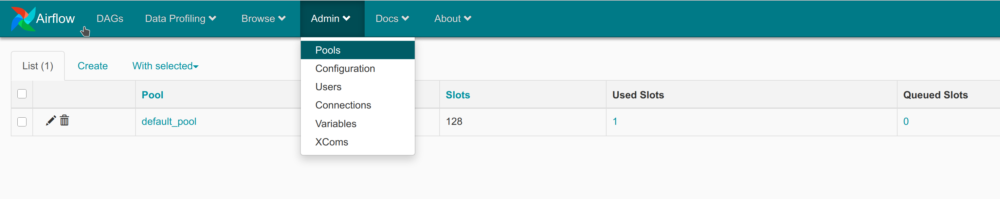
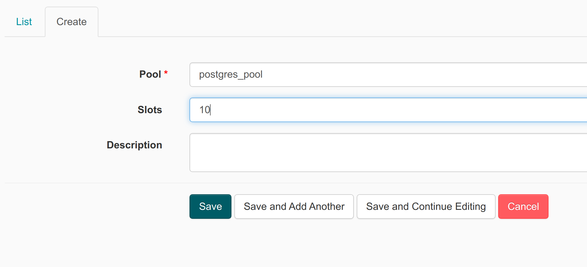

# Pools and Task Concurrency

Task concurrency is determine how many task is able run at the same time.

### `task_concurrency`

This variable controls the number of concurrent running task instances across dag_runs per task

example:

```python
read_task = PythonOperator(
    task_id="read",
    python_callable=read_data,
    dag=dag,
    task_concurrency=10
)
```

### `concurrency`

Airflow scheduler will run no more than concurrency task instances for your DAG at any given time. Concurrency is defined in your Airflow DAG. If you do not set the concurrency on your DAG, the scheduler will use the default value from the `dag_concurrency` entry in your `airflow.cfg`

example:

```python
dag = DAG(
  dag_id=f'{owner}.lesson3.excercise8',
  start_date=airflow.utils.dates.days_ago(3),
  schedule_interval=None,
  concurrency=15
)
```

### `max_active_runs`

Airflow scheduler will run no more than max_active_runs DagRuns of your DAG at a given time. If you do not set the max_active_runs in your DAG, the scheduler will use the default value from the max_active_runs_per_dag entry in your `airflow.cfg`

example:

```python
dag = DAG(
  dag_id=f'{owner}.lesson3.excercise8',
  start_date=airflow.utils.dates.days_ago(3),
  schedule_interval=None,
  max_active_runs=2
)
```

### `parallelism`

This variable controls the number of task instances that runs simultaneously across the whole Airflow cluster. User could increase the `parallelism` variable in the `airflow.cfg`

### `pool`

controls the number of concurrent running task instances assigned to the pool



to create new pools



example use:

```python
read_task = PythonOperator(
    task_id="read",
    python_callable=read_data,
    dag=dag,
    pool='postgres_pool'
)
```
