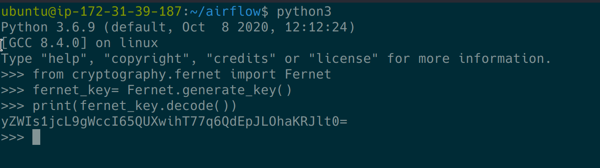

# Security

## Fernet Key (Encryption Key)

Airflow uses Fernet to encrypt passwords in the connection configuration. It guarantees that a password encrypted using it cannot be manipulated or read without the key. Fernet is an implementation of symmetric (also known as “secret key”) authenticated cryptography.

The first time Airflow is started, the `airflow.cfg` file is generated with the default configuration and the unique Fernet key. The key is saved to option fernet_key of section `[core]`.

You can also configure a fernet key using environment variables. This will overwrite the value from the `airflow.cfg` file

```bash
# Note the double underscores
export AIRFLOW__CORE__FERNET_KEY=your_fernet_key
```

### Generate New Fernet Key

To generate fernet key you could use python3 console by command

```bash
python3
```

then paste this code

```python
from cryptography.fernet import Fernet
fernet_key= Fernet.generate_key()
print(fernet_key.decode()) # your fernet_key, keep it in secured place!
```



copy resulted code then keep it in secured place!

### Rotating Fernet Key

Security practice usually involves change encryption key every time period in or commonly say **"Rotating Encryption Key"**

Because connection data already encrypted by old fernet key, directly changing the key will cause decryption of existing credentials to fail.

Here is how you change your old key.

If you are using `airflow.cfg` to setup fernet key then Go to your `airflow.cfg` and change `fernet_key` to `new_fernet_key,old_fernet_key`

For example if before fernet key

```bash
fernet_key = yZWIs1jcL9gWccI65QUXwihT77q6QdEpJLOhaKRJlt0=
```

then change to

```bash
fernet_key = yZWIs1jcL9gWccI65QUXwihT77q6QdEpJLOhaKRJlt0=,OosacLKM8v-UoXIPhqBEeIrOrfVex9jqM2XiMsfAp5M=
```

after that run command

```bash
airflow rotate_fernet_key
```

then set `fernet_key` to `new_fernet_key`

```bash
fernet_key = OosacLKM8v-UoXIPhqBEeIrOrfVex9jqM2XiMsfAp5M=
```
