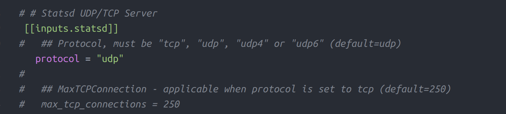
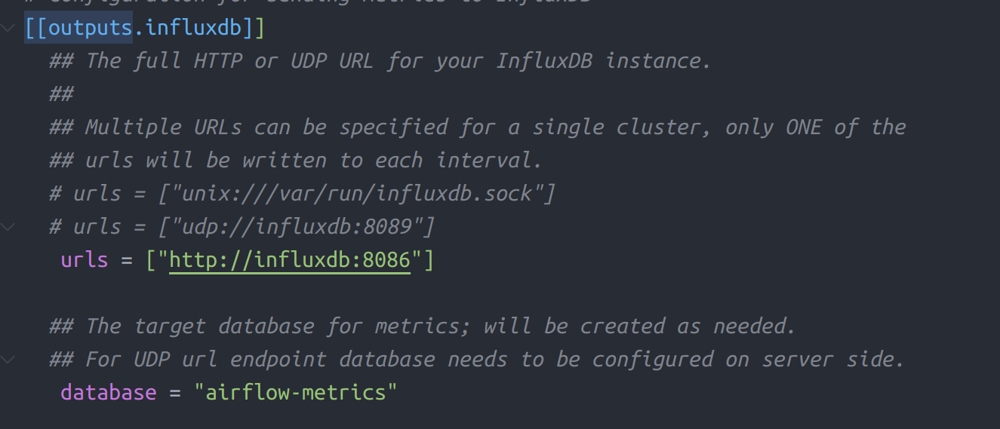

# Airflow Monitoring

## Overview

### How it works

1. Airflow publish **StatsD** metrics to **Telegraf**
2. **Telegraf** recevied metrics from airflow and persist it to **InfluxDB**
3. **Grafana** read metrics data from **InfluxDB**

### StatsD

StatsD is a simple daemon developed and released by Etsy in order to aggregate and summarize application metrics. You can think of StatsD as a push-based monitoring system where it receives metric logs from an application and push them to somewhere else such as ElasticSearch or InfluxDB for example.

StatsD support is built-in to Apache Airflow using the Python client of statsd in order to expose its metrics. Basically, Airflow pushes three type of metrics to the StatsD daemon:

- The Counters
- The Gauges
- The Timers

Each type of metrics brings different information such as the number of overall task failures, the scheduler heartbeat to know if it is up or down, the number of queued tasks on executor, the seconds to load a given DAG and much more. You can find all the metrics available by looking at the documentation right here.

### Telegraf

Telegraf is an open source agent for collecting, processing and aggregating metrics. Once data are collected, they are pushed to various outputs such as InfluxDB, ElasticSearch, Syslog and so on. Telegraf is very lightweight and works with a system of plugins that you can add or remove from each phase your metrics go through (collecting, processing, aggregating, pushing). You can find the exhaustive list of plugins right here.

### InfluxDB

InfluxDB is an open source time series database written in Go, built from the ground up to handle high write and query loads. InfluxDB is meant to be used as a backing store for any use case involving large amounts of timestamped data, including DevOps monitoring, application metrics, IoT sensor data, and real-time analytics.

### Grafana

Grafana is an open source data visualization and monitoring suite. It supports many databases such as ElasticSearch, Prometheus or InfluxDB. The tool gives you the ability to create very complex and beautiful dashboards mixing different data sources at one place. It is also widely used to set alerts according to the metrics and thresholds you have.

## Configuration

Copy file `CeleryExecutor.yaml` from [previous topics](2.%20CeleryExecutor%20Installation.md) and rename it to `AirflowMonitoring.yaml`

### Configure InfluxDB

Add new service `influxdb` to docker compose `AirflowMonitoring.yaml` file after service `postgres`

```yaml
influxdb:
  container_name: influxdb
  image: influxdb:1.7.8
  ports:
    - '8083:8083'
    - '8086:8086'
```

This config will add new service with name `influxdb`.

- It will use image `influxdb` version `1.7.8`
- port `8083` will be used to influxdb web ui
- port `8086` will be used as metrics endpoit

### Configure Telegraf

Add new service `telegraf` to docker compose `AirflowMonitoring.yaml` file after service `influxdb`

```yaml
telegraf:
  container_name: telegraf
  image: telegraf:1.12.3
  depends_on:
    - influxdb
  volumes:
    - ./telegraf.conf:/etc/telegraf/telegraf.conf
```

This config will add new service with name `telegraf`.

- It will use image `telegraf` version `1.12.3`
- it will mount local file `telegraf.conf` to docker container `/etc/telegraf/telegraf.conf`

copy file [`telegraf.conf`](./docker-compose/telegraf.conf) to directory where `AirflowMonitoring.yaml` located.

#### Open input from StatsD

1. Open and edit file `telegraf.conf`
2. Search text `[[inputs.statsd]]` and make sure is not commented
3. Change `protocol` to `udp`



#### Enable output to InfluxDB

1. Open and edit file `telegraf.conf`
2. Search text `[[outputs.influxdb]]` and make sure is not commented
3. Change value `urls` to `["http://${INFLUXDB_HOST}:8086"]`, replace `${INFLUXDB_HOST}` with your influxdb host in this tutorial we will use `["http://influxdb:8086"]`
4. Change value `database` to your desired database name. for example `airflow-metrics`.



### Configure Airflow

To enable StatsD metrics, Airflow need package `apache-airflow[statsd]`. So open your `requirments.txt` file then paste `apache-airflow[statsd]` at the end line.

Add this environment variables to `webserver`, `scheduler` and `worker` services

```yaml
environment:
  - FERNET_KEY=46BKJoQYlPPOexq0OhDZnIlNepKFf87WFwLbfzqDDho=
  - EXECUTOR=Celery
  - AIRFLOW__SCHEDULER__STATSD_HOST=telegraf
  - AIRFLOW__SCHEDULER__STATSD_PORT=8125
  - AIRFLOW__SCHEDULER__STATSD_PREFIX=airflow
  - AIRFLOW__WEBSERVER__WORKER_REFRESH_INTERVAL=5
```

And mount file `requirements.txt` to `webserver`, `scheduler` and `worker` services

```yaml
volumes:
  - ./dags:/usr/local/airflow/dags
  - ./requirements.txt:/requirements.txt
```

### Configure Grafana

At the end file `AirflowMonitoring.yaml` add this configuration

```yaml
grafana:
  container_name: grafana
  image: grafana/grafana
  ports:
    - '3000:3000'
```

## Starting Monitoring

### Run docker compose

```bash
docker-compose -f AirflowMonitoring.yaml up -d
```

### Grafana

Open grafana at [localhost:3000](http://localhost:3000)
